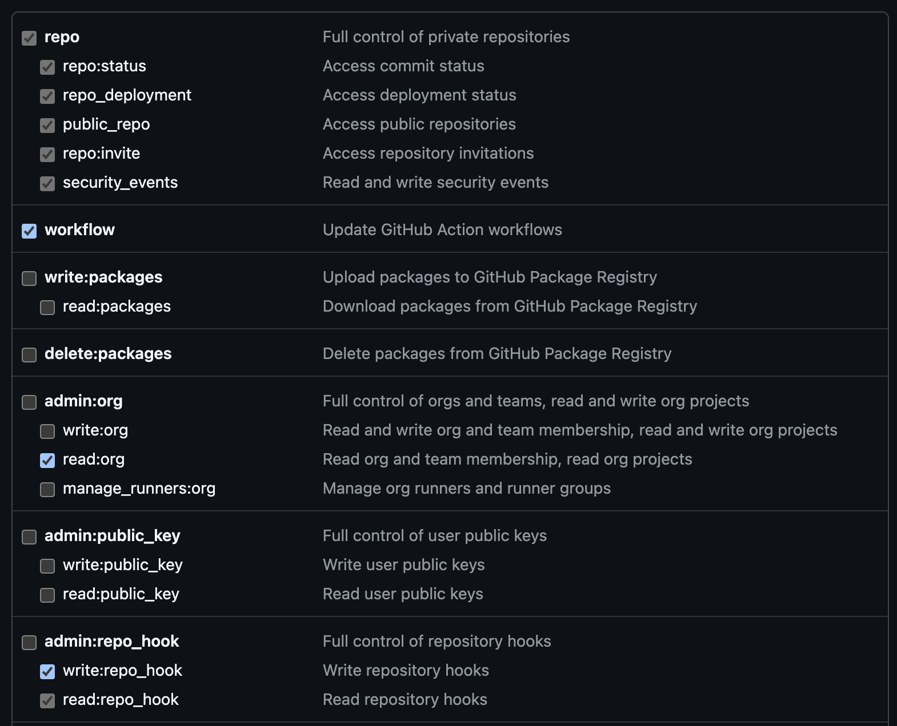
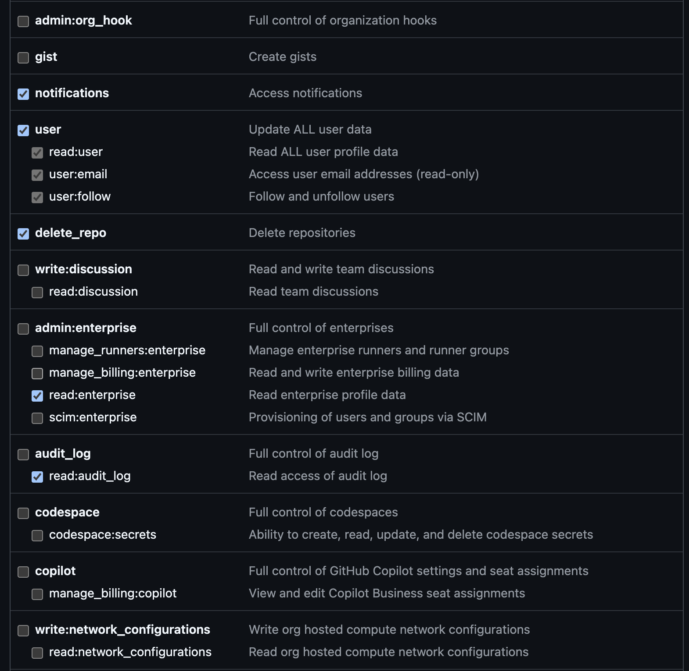
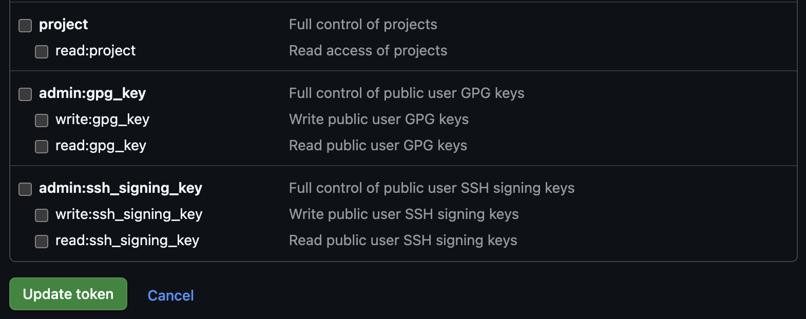
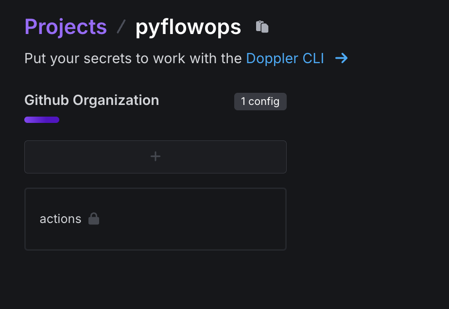
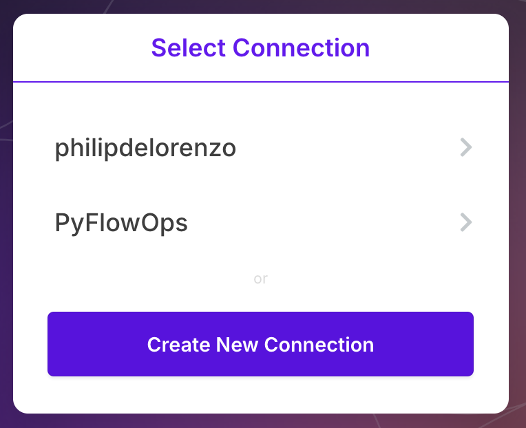
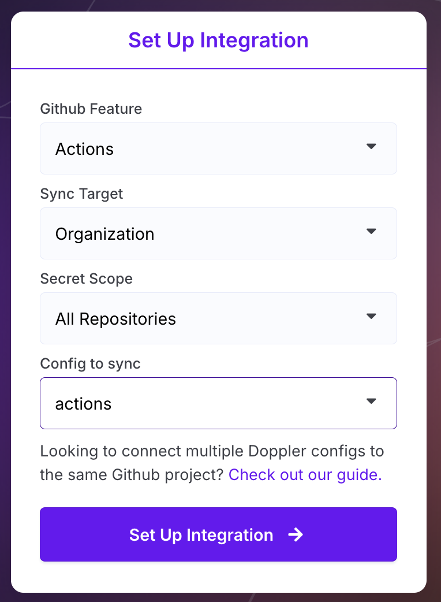
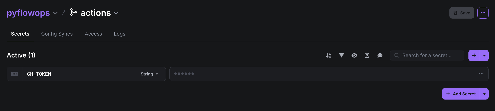
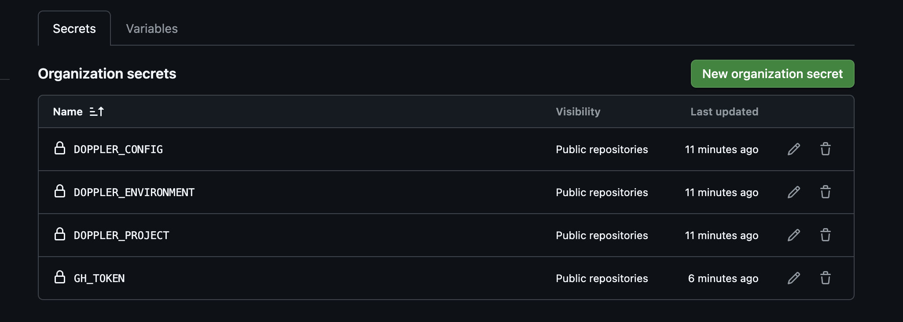

# Getting Started

PyFlowOps can seem a bit duanting as there are many moving parts, but we
promise, this is designed to make building Python applications in the
public cloud...easy. This project, even with the idiosyncradic differences,
and nuance, is designed to introduce a developer into the public cloud with
less need for pre-existing knowledge _(which takes a decent amount of time to
acquire)_, and to be able to instantiate a project quickly.

From front-ends, to API's on the backend, internal tooling with CLI's, etc. the
whole process can be really difficult, requiring the combination of many different
minds, minds that do not come easily, or cheaply. If you have a great idea as a
business owner, or a developer...this project can be a great way to get up-and-running
in the Cloud.

## 1. Setup your Github Organization

Set up a Github Organization for housing all of your repos, code, etc.

See [Creating an Organization](https://docs.github.com/en/organizations/collaborating-with-groups-in-organizations/creating-a-new-organization-from-scratch){target="_blank"}

## 2. Create a Github Access Token (PAT)

Soon, we will develop a Github Application for this process, but until then, the Github Personal Access Token (PAT)
is the best way to connect into your organization and run the commands.

See [Managing a Personal Access Token](https://docs.github.com/en/authentication/keeping-your-account-and-data-secure/managing-your-personal-access-tokens){target="_blank"}

You can add more access if you need to, but here is the access that the token should have (classic):

## 3. Setup your Doppler Account

You will need to create a Doppler account, you can register [here](https://dashboard.doppler.com/register){target="_blank"}.

#### Create a Doppler Project for your Organization

Once registered, let's create a project for your organization, i.e. `pyflowops` --> this is to sync Organization
level secrets to use in your Github Actions.

See [Create Doppler Project](https://docs.doppler.com/docs/create-project){target="_blank"}

Once the project is created, let's set the Environment, and Configs!

This project is meant ONLY for Github Organization secrets for Github Actions. Doppler will create three environments by
default, `Development`, `Staging`, `Production` -- We can delete ALL but the `Production` environment for this project.

Rename `Production` to `Github Organization`, and set the slug for the environment to `actions`. You should see something like this:

#### Config Sync the Project

**STOP!!!** This only works if the repo is private, UNLESS you have an upgraded Github account. If you are running the free tier, you will need
to make your repos public to access the Organization secrets.

Now that the Org secrets project has been created, let's setup a `Config Sync` in Doppler to your Organization.

NOTE: If you try to setup a `Config Sync` and you do not see your organization, the click `Create New Connection` and select
the Github Organization.

See [Github Action Sync](https://docs.doppler.com/docs/github-actions){target="_blank"}

To sync all of your secrets for Github Actions:

Github Feature: `Actions`
Sync Target: `Organization`
Secret Scope: `All Repositories`
Config to Sync: `actions` _the config in the Github Organization environment in your Organization Project_

#### Add PAT to Doppler Project _(Organization)_

In your Organization Project, under the `Github Organization` environment _(renamed from Production)_, let's add a secret:

We need to add the PAT _(Personal Access Token)_ that you created in the previous step, i.e. `GH_TOKEN` --> `Value`

NOTE: If you set everything up correctly, you should now see that there is an Organization secret available to your Github Actions
called GH_TOKEN...

You can find this data here --> https://github.com/organizations/`<your-organization>`/settings/secrets/actions

## Setup Your First Repo

Install the `pfo CLI` -- Coming Soon!

[PyFlowOps Repo Template](https://github.com/pyflowops/base-repo-template){target="_blank"}
